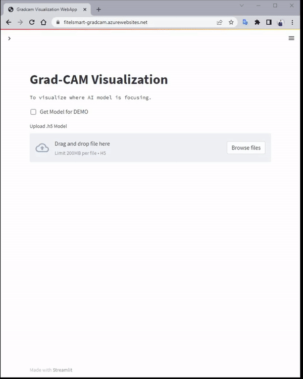

# Grad-CAM App & API
## The Grad-CAM
Gradient Class Activation Maps(Grad-CAM) are a visualization technique for deep learning networks.
<!--  -->
See the paper: [Grad-CAM: Visual Explanations from Deep Networks
via Gradient-based Localization](https://arxiv.org/pdf/1610.02391v1.pdf) 

<!--  -->

Grad-CAM visualizations of the model predictions (see the red regions in the middle column) revealed
that the model had learned to look at the person’s face / hairstyle to distinguish nurses from doctors, thus learning a gender stereotype. Indeed, the model was misclassifying several female doctors to be a nurse and male nurses to be a doctor. Clearly, this is problematic. Turns out the image search results were gender-biased
## Grad-CAM in Fitel Smart
Fitel Smart App: [fitelsmart-gradcam-app](https://fitelsmart-gradcam.azurewebsites.net/) 
is provide to visulize where AI model is focussing, 
### Insert your model
You can upload your .h5 model.

<!--  -->

Then upload your image file.

<!--  -->

### Demo model
You can select demo model by click the "Get Model for demo" checkbox.

## Site Reference
Fitel Smart App: [fitelsmart-gradcam-app](https://fitelsmart-gradcam.azurewebsites.net/) 

API Tester (Swagger) : [fitelsmart-gradcam-api Swagger](https://fitelsmart-gradcam-api.azurewebsites.net/docs)

API documentation (Redoc) : [fitelsmart-gradcam-api Redoc](https://fitelsmart-gradcam-api.azurewebsites.net/redoc)
